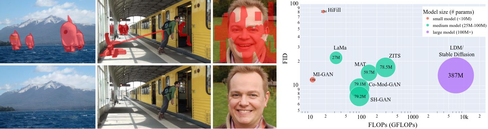

# MI-GAN: A Simple Baseline for Image Inpainting on Mobile Devices

This repository is the official implementation of MI-GAN.

**[MI-GAN: A Simple Baseline for Image Inpainting on Mobile Devices](https://openaccess.thecvf.com/content/ICCV2023/papers/Sargsyan_MI-GAN_A_Simple_Baseline_for_Image_Inpainting_on_Mobile_Devices_ICCV_2023_paper.pdf)**
</br>
[Andranik Sargsyan](https://scholar.google.com/citations?user=cg74A98AAAAJ&hl=ru&oi=ao),
[Shant Navasardyan](https://scholar.google.com/citations?user=VJSh59sAAAAJ&hl=ru&oi=ao),
[Xingqian Xu](https://ifp-uiuc.github.io/),
[Humphrey Shi](https://www.humphreyshi.com)
</br>

[[Paper](https://openaccess.thecvf.com/content/ICCV2023/papers/Sargsyan_MI-GAN_A_Simple_Baseline_for_Image_Inpainting_on_Mobile_Devices_ICCV_2023_paper.pdf)] | [[Supplementary](https://openaccess.thecvf.com/content/ICCV2023/supplemental/Sargsyan_MI-GAN_A_Simple_ICCV_2023_supplemental.pdf)]

<p align="center">
  
<br>
<em>Our method MI-GAN can produce plausible results both on complex scene images as well as on face images. The bubble chart on the right shows
the advantage of our network over state-of-the-art approaches. The size of the bubble signifies the relative number of parameters of each
approach and the number inside of the bubble shows the absolute number of model parameters. Our approach achieves a low FID, while
being one order of magnitude smaller and faster than recent SOTA approaches.</em>
</p>

## Third-Party Implementations
(Feel free to share your app/implementation/demo by creating an issue)

- 🔥 [https://inpaintweb.lxfater.com](https://inpaintweb.lxfater.com/) - an open-source tool for in-browser inpainting by [@lxfater](https://twitter.com/lxfater), [[GitHub project]](https://github.com/lxfater/inpaint-web)
- 📱 [inpaint_wechat](https://github.com/shifu-group/inpaint_wechat) - a WeChat mini-program for on-device inpainting by [@zhiyuan](https://x.com/zhiyuan54030554), [[GitHub project]](https://github.com/shifu-group/inpaint_wechat)
- 💻 [IOPaint](https://github.com/Sanster/lama-cleaner/releases/tag/iopaint-1.0.0b2) - a free and open-source inpainting tool powered by SOTA AI models by [@Sanster](https://twitter.com/sfjccz), [[GitHub project]](https://github.com/Sanster/lama-cleaner)
  - To use MI-GAN model with IOPaint run
    ```commandline
    pip install iopaint
    iopaint start --model migan
    ```
    in the terminal and open http://localhost:8080/

See [For Developers](#for-developers) section below for easy-to-use MI-GAN ONNX Pipeline creation script, and for a pre-generated ONNX file, which can be seamlessly integrated into your app.

## Prepare environment

Prepare the environment (Python>=3.8 is needed):
```commandline
sudo apt install python3-venv
python3 -m venv venv
source ./venv/bin/activate
pip install pip --upgrade
pip install -r requirements.txt
```

Download pre-trained MI-GAN models from [here](https://drive.google.com/drive/folders/1xNtvN2lto0p5yFKOEEg9RioMjGrYM74w?usp=share_link) and put into `./models` directory.
If you also want to test with Co-Mod-GAN models, download pre-trained models from [here](https://drive.google.com/drive/folders/1VATyNQQJW2VpuHND02bc-3_4ukJMHQ44?usp=share_link) and put into `./models` directory.

## Quick Test
For getting visual results, use `demo.py` script like this

```
python -m scripts.demo \
    --model-name migan-512 \
    --model-path ./models/migan_512_places2.pt \
    --images-dir ./examples/places2_512_object/images \
    --masks-dir ./examples/places2_512_object/masks \
    --output-dir ./examples/places2_512_object/results/migan \
    --device cuda \
    --invert-mask
```
For running with Co-Mod-GAN, change `--model-name` and `--model-path` accordingly.
Also, depending on what the white color means in your masks, you may or may not need `--invert-mask` flag.
By default white color denotes the known region.

To run inference on provided FFHQ samples, run

```
python -m scripts.demo \
    --model-name migan-256 \
    --model-path ./models/migan_256_ffhq.pt \
    --images-dir ./examples/ffhq_256_freeform/images \
    --masks-dir ./examples/ffhq_256_freeform/masks \
    --output-dir ./examples/ffhq_256_freeform/results/migan \
    --device cuda
```

You can find more example images and masks in `examples` directory, and modify the above command to reproduce all
MI-GAN and Co-Mod-GAN results presented in the Supplementary material.

**Note:** With our provided free-form masks, `--invert-mask` option **should not** be used with the command.

**Note:** Even though our method is fully convolutional, the provided `lib/model_zoo/migan_inference.py` implementation currently performs some fixed-resolution operations. If you need fully convolutional support, you need to make `filter_const` and `noise_const` computations dynamic (depending on the input size). See `self.register_buffer` in `SeparableConv2d` class and in `Upsample2d` class.

## Evaluation
For MI-GAN evaluation on Places2 download Places365-Standard 256x256 and high resolution validation images 
from [Places2 official website](http://places2.csail.mit.edu/download.html).

Then, for evaluating MI-GAN FID and LPIPS on Places2 256x256 run
```
python -m scripts.evaluate_fid_lpips \
    --model-name migan-256 \
    --model-path ./models/migan_256_places2.pt \
    --real-dir PATH_TO_PLACES256_VALIDATION_IMAGES
```

For evaluating MI-GAN FID and LPIPS on Places2 512x512 run
```
python -m scripts.evaluate_fid_lpips \
    --model-name migan-512 \
    --model-path ./models/migan_512_places2.pt \
    --real-dir PATH_TO_PLACES512_VALIDATION_IMAGES
```

For MI-GAN evaluation on FFHQ 256x256 download FFHQ dataset from the [official source](https://github.com/NVlabs/ffhq-dataset), copy the first 10,000 samples
into a separate validation directory, and then run
```
python -m scripts.evaluate_fid_lpips \
    --model-name migan-256 \
    --model-path ./models/migan_256_ffhq.pt \
    --real-dir PATH_TO_FFHQ_VALIDATION_IMAGES
```

The above commands will generate new free-form masks on the fly for doing the inference, but you can also download
our pre-generated masks for Places2 256x256, Places2 512x512 and FFHQ 256x256 validation sets from
[here](https://drive.google.com/drive/folders/1LG34GoCKX5ZnkOjLckFaF2v3ctCAYvfk?usp=share_link)
and use those for metrics calculations by providing an additional `--mask-dir` argument in above commands, where
`--mask-dir` will point to the respective pre-generated mask directory.

Besides, you can generate your own free form masks using our script like so
```
python -m scripts.generate_masks \
    --images-dir PATH_TO_ORIGINAL_IMAGES_DIR \
    --output-dir MASK_OUTPUT_PATH \
    --resolution MASK_RESOLUTION
```

For Co-Mod-GAN metrics calculation change `--model-name` and `--model-path` accordingly. For example, in order to calculate Co-Mod-GAN metrics on FFHQ 256x256, run
```
python -m scripts.evaluate_fid_lpips \
    --model-name comodgan-256 \
    --model-path ./models/comodgan_256_ffhq.pt \
    --real-dir PATH_TO_FFHQ_VALIDATION_IMAGES
```

If your GPU doesn't have enough memory for running the evaluation with default `batch-size`, you can reduce batch size
by providing `--batch-size` argument with a low batch size in above commands. 

### FLOPs and parameter count calculation
In order to calculate FLOPs and parameter counts for MI-GAN and Co-Mod-GAN models you can run
```
python -m scripts.calculate_flops
```

## Training

In order to smoothly run the training without changes, you need to have the following directory structure for datasets (data folder should be in the root project folder).

```
data
 | 
 +-- ffhq
 |  |  
 |  +-- ffhq256x256.zip
 |    
 +-- Places2
 |  |  
 |  +-- train_256
 |  +-- val_256
 |  +-- train_512
 |  +-- val_512
```

Also you need to download pre-trained Co-Mod-GAN models from [here](https://drive.google.com/drive/folders/1VATyNQQJW2VpuHND02bc-3_4ukJMHQ44?usp=share_link)
and put into `models` directory. `models` directory should have the following structure:
```
models
|  
| +-- comodgan_256_ffhq.pt
| +-- comodgan_256_places2.pt
| +-- comodgan_512_places2.pt
```

Then, for training MI-GAN 256 on Places 2 using 8 GPUs, run
```
./run.sh migan_places256 gpu01234567
```


For training MI-GAN 512 on Places 2 using 8 GPUs, run
```
./run.sh migan_places512 gpu01234567
```


For training MI-GAN 256 on FFHQ using 8 GPUs, run
```
./run.sh migan_ffhq256 gpu01234567
```

You can choose to run on specific GPUs. For example, if you want to run on GPUs 0,1,2,3, run the above commands with argument gpu0123. For more details, please see `run.sh` helper script.

After training you can generate the inference model from the saved best checkpoint with this command:
```bash
python -m scripts.export_inference_model \
    --model-path PATH_TO_BEST_PLACES512_PKL \
    --origs-dir ./examples/places2_512_freeform/images \
    --masks-dir ./examples/places2_512_freeform/masks \
    --output-dir ./exported_models/migan_places512 \
    --resolution 512 
```
The above example is for *places2-512* model. You need to change the `--resolution` argument to `256` for 256 models.
The exported onnx and pt models and sample results will be saved in the specified `--output-dir` directory.

## For Developers
We provide a script to convert the whole MI-GAN pipeline into ONNX for easier use in real-world applications. Please see `scripts/create_onnx_pipeline.py` for details. Here is an example usage of the script:

```bash
python -m scripts.create_onnx_pipeline \
    --resolution 512 \
    --model-path ./models/migan_512_places2.pt \
    --images-dir ./examples/places2_512_object/images \
    --masks-dir ./examples/places2_512_object/masks \
    --output-dir ./exported_models/places2_512_onnx_pipeline \
    --device cpu \
    --invert-mask
```

The generated ONNX model expects `image` and `mask` as an input, where `image` is a uint8 RGB image, and `mask` is a uint8 Grayscale mask (where 255 denotes known region values, 0 denotes masked region).

Pipeline does almost all necessary preprocessing (uint8->float32 conversion, cropping around the mask, resize to 512x512, normalization) and postprocessing (resizing to original, blending, float32->uint8 conversion). You just need to provide the right image and mask (must be binary). 

The Pipeline supports arbitrary resolution inputs, but please note that when inpainting high resolution images the best results can be achieved with small, incremental brush strokes (if the inpainting area is large).

Pre-converted ONNX file for MI-GAN-512-Places2 Pipeline can be found [here](https://huggingface.co/andraniksargsyan/migan/resolve/main/migan_pipeline_v2.onnx).

**Note for researchers:** The inference times reported in the paper are not based on the provided ONNX Pipeline. We measured the pure model inference times, whereas ONNX Pipeline introduced in this section includes complex pre-processing and post-processing, which are not included in reported times.

## BibTeX
If you use our work in your research, please cite our publication:
```
@InProceedings{Sargsyan_2023_ICCV,
    author    = {Sargsyan, Andranik and Navasardyan, Shant and Xu, Xingqian and Shi, Humphrey},
    title     = {MI-GAN: A Simple Baseline for Image Inpainting on Mobile Devices},
    booktitle = {Proceedings of the IEEE/CVF International Conference on Computer Vision (ICCV)},
    month     = {October},
    year      = {2023},
    pages     = {7335-7345}
}
```

## Acknowledgement

Our code is built upon [SH-GAN](https://github.com/SHI-Labs/SH-GAN).
